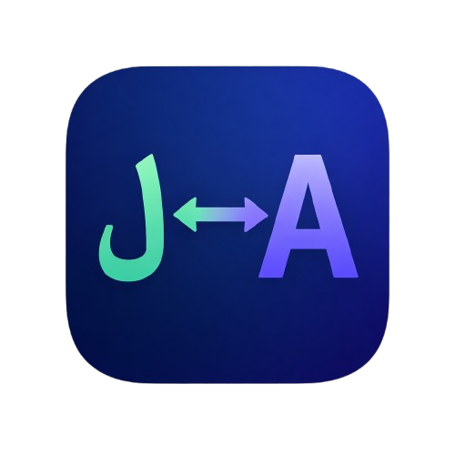

<div align="center">



# Claude RTL Fix

**Full RTL support for Claude.ai**

Persian | Arabic | Hebrew | Urdu

[](https://claude.ai)
[](manifest.json)
[](LICENSE)

---

</div>

## The Problem

Claude.ai renders **all** responses in LTR (Left-to-Right). If you chat in Persian, Arabic, or Hebrew, the output looks broken:

- Text is left-aligned instead of right-aligned
- Numbers and English words appear in wrong positions
- Lists, blockquotes, and tables are mirrored incorrectly
- Math formulas (KaTeX) break when inside RTL paragraphs
- Navigation arrows point the wrong way
- Code blocks with RTL comments are unreadable

**This extension fixes all of that.**

## Features

| Feature | Description |
|---|---|
| **Smart RTL Detection** | Automatically detects RTL-dominant blocks (paragraphs, headings, list items, table cells) with a 25% threshold |
| **BiDi Number/Word Fix** | Wraps English words and numbers in Unicode Isolates so they appear in the correct position within RTL flow |
| **Arrow Mirroring** | Swaps directional arrows (`→` `⇒` `➡` ...) to RTL equivalents with proper word reordering around them |
| **KaTeX / LaTeX** | Math formulas stay LTR (as they should) even inside RTL blocks — subscripts and operators render correctly |
| **Code Blocks** | Text/pseudocode blocks get full RTL; actual code (Python, JS, ...) uses per-line BiDi detection |
| **Mermaid Diagrams** | RTL text inside SVG diagram nodes is detected and fixed |
| **Lists & Blockquotes** | Bullets and quote borders move to the right side |
| **Tables** | RTL cells get `direction: rtl` and `text-align: right` |
| **One-Click Toggle** | Enable/disable from the extension popup without reloading |
| **Zero UI Impact** | Only touches Claude's response content — never the sidebar, input box, or navigation |

## Installation

### From Source (Developer Mode)

1. **Clone** this repository:
   ```bash
   git clone https://github.com/MSadeghSeyfi/claude-rast.git
   ```
2. Open **Chrome** and go to `chrome://extensions/`
3. Enable **Developer mode** (top-right toggle)
4. Click **Load unpacked** and select the cloned folder
5. Open [claude.ai](https://claude.ai) — RTL text now renders correctly

> **Tip:** The extension also works on **Edge**, **Brave**, **Arc**, and any Chromium-based browser.

## How It Works

The extension injects a content script and stylesheet into Claude.ai. A `MutationObserver` watches for new content as Claude streams responses, and applies fixes in real-time:

```
1. Block Scan     → Find <p>, <li>, <h1>-<h6>, <td>, etc.
2. RTL Detection  → Check if text is RTL-dominant (>25% RTL chars)
3. Apply dir=rtl  → Set direction and text-align on detected blocks
4. BiDi Isolation → Wrap English words/numbers in LRI...PDI isolates
5. Arrow Fix      → Swap arrows + isolate surrounding words
6. KaTeX Guard    → Force .katex elements to dir=ltr
7. Code Blocks    → Full RTL for text blocks, per-line BiDi for code
8. Mermaid Fix    → Handle RTL in SVG <text> and <foreignObject>
```

## Project Structure

```
claude-rast/
├── manifest.json       # Chrome Extension Manifest V3
├── content.js          # Core logic — RTL detection, BiDi fixes, KaTeX guard
├── styles.css          # Injected CSS — RTL layout rules
├── background.js       # Service worker — default enabled state
├── popup.html          # Extension popup UI (dark theme, RTL)
├── popup.js            # Popup toggle logic
├── icons/              # Extension icons (16, 32, 48, 128px)
└── img/                # README assets
```

## Compatibility

| | Supported |
|---|---|
| **Browsers** | Chrome, Edge, Brave, Arc, Opera, Vivaldi |
| **Target Site** | `https://claude.ai/*` |
| **Languages** | Persian (Farsi), Arabic, Hebrew, Urdu, and any RTL script |
| **Manifest** | V3 |

## Contributing

Contributions are welcome! If you find a rendering edge case or have an idea for improvement:

1. Fork the repo
2. Create a feature branch (`git checkout -b fix/my-fix`)
3. Commit your changes
4. Open a Pull Request

## Author

**Mohammad Sadegh Seyfi** — [@MSadeghSeyfi](https://github.com/MSadeghSeyfi)

## License

[MIT](LICENSE)
